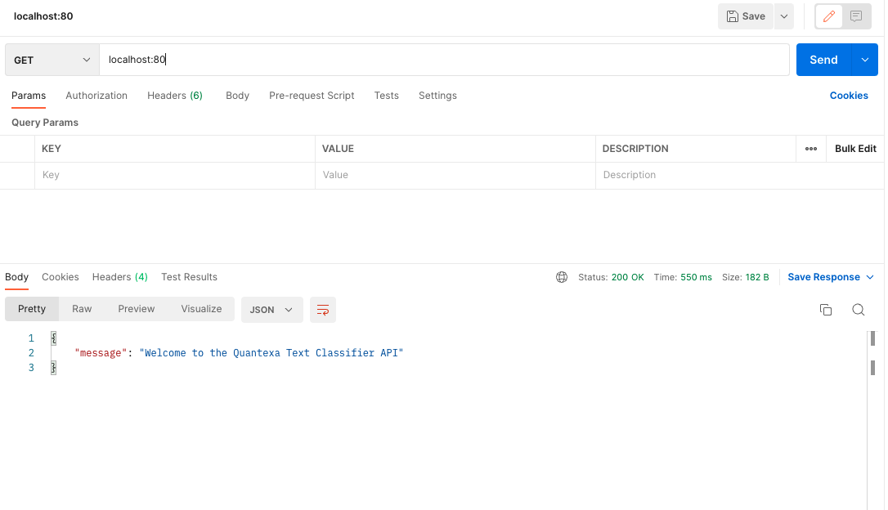
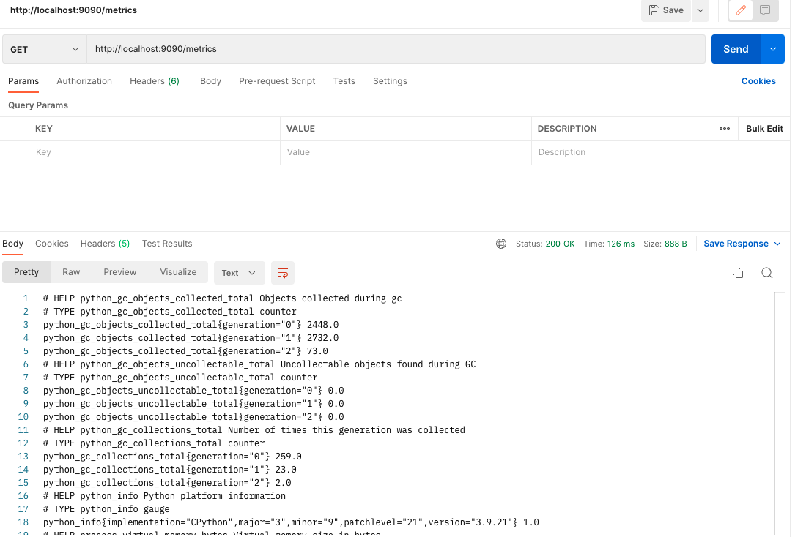
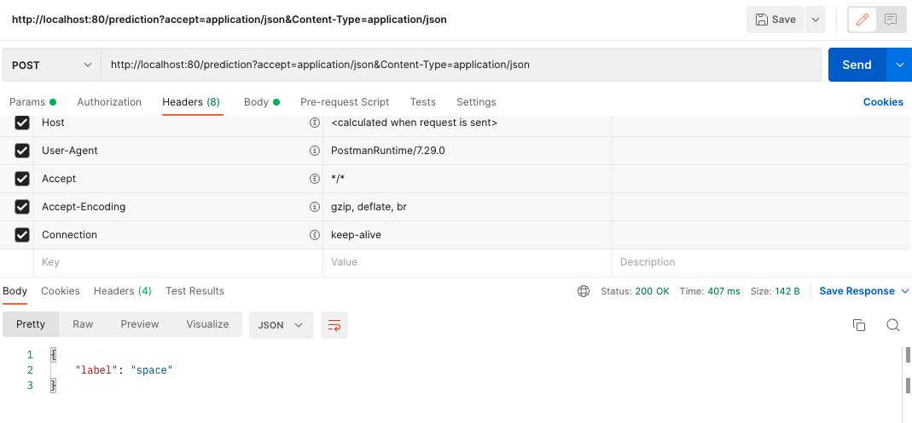

# Text Classifier API

This project implements a text classification service using FastAPI. The service includes endpoints for making predictions, retrieving metrics, and serving the OpenAPI specification.

## Problems to Solve

1. **Provide an appropriate evaluation of the model performance on the test data.**
2. **Implement a way to persist the trained model to local disk.**
3. **Implement an API according to the OpenAPI specification.**
4. **Create a web service (in Python 3) to serve the persisted model.**
5. **Deploy the model locally.**
6. **Create a container with your solution that can be run on Kubernetes.**
7. **Provide some sample curl commands or a [Postman](https://www.postman.com/) collection.**
8. **Stretch Goal 1 - Suggest and/or implement improvements to the model.**
9. **Stretch Goal 2 - Testing of the API before deployment.**
10. **Stretch Goal 3 - Metrics API for inspecting current metrics of the service.**

## Solutions

### 1. Provide an appropriate evaluation of the model performance on the test data.

To evaluate the model's performance, we used a separate test dataset that was not seen by the model during training. This ensures an unbiased evaluation of the model's generalization capabilities. We calculated several evaluation metrics, including accuracy, precision, recall, and F1 score. These metrics provide a comprehensive understanding of the model's performance:
- **Accuracy** measures the overall correctness of the model.
- **Precision** indicates the accuracy of the positive predictions.
- **Recall** measures the model's ability to capture all relevant instances.
- **F1 Score** is the harmonic mean of precision and recall, providing a balanced measure of the model's performance.


### 2. Implement a way to persist the trained model to local disk.

To persist the trained model, we used the `joblib` library, which is efficient for serializing and deserializing Python objects. After training the model, it was saved to a local file in the `models` directory. This allows the model to be loaded and used for predictions without retraining, ensuring efficiency and consistency. The model can be easily reloaded for future use, making the deployment process more streamlined.


### 3. Implement an API according to the OpenAPI specification.

An API was implemented using the FastAPI framework, adhering to the OpenAPI specification defined in the `prediction-openapi.yaml` file. The API includes endpoints for making predictions, retrieving metrics, and serving the OpenAPI specification itself. This ensures that the API is well-documented and easy to integrate with other systems. The OpenAPI specification provides a standardized format for describing the API, making it easier for developers to understand and use the API.


### 4. Create a web service (in Python 3) to serve the persisted model.

A web service was created using FastAPI to serve the persisted model. The service includes endpoints for making predictions and retrieving metrics. The FastAPI framework was chosen for its performance, ease of use, and automatic generation of interactive API documentation. This web service allows users to interact with the model through a simple HTTP interface, making it accessible for various applications.


### 5. Deploy the model locally.

To deploy the model locally, we used Uvicorn, an ASGI server for serving FastAPI applications. The application was configured to run on `localhost` with the specified port, allowing for local testing and development. This setup ensures that the model can be easily accessed and tested on a local machine. Local deployment is crucial for development and debugging, allowing developers to test the application in an environment similar to production.


### 6. Create a container with your solution that can be run on Kubernetes.

A Docker container was created to encapsulate the entire solution, including the FastAPI application and the persisted model. The Dockerfile was configured to install dependencies, copy the application code, and expose the necessary ports. The container was then pushed to a Docker registry and deployed to a Kubernetes cluster using deployment and service configurations. This ensures that the solution is portable, scalable, and easy to manage. Containerization allows the application to run consistently across different environments, and Kubernetes provides orchestration for scaling and managing the application.


### 7. Provide some sample curl commands or a Postman collection.

Sample `curl` commands and a Postman collection were provided to demonstrate how to interact with the API. These examples include making predictions and retrieving metrics, showcasing the API's functionality and ease of use. This helps users quickly understand how to use the API and integrate it into their workflows.

#### Sample `curl` Commands

- **Make a Prediction**:
  ```sh
  curl -X 'POST' \
    'http://localhost:8000/prediction' \
    -H 'accept: application/json' \
    -H 'Content-Type: application/json' \
    -d '{
    "text": "Your input text here"
  }'
    ```

  - **Retrieve Metrics:**:

  ```sh
    curl -X 'GET' 'http://localhost:8000/metrics'
    ```

In the following images see the real execution with postman:

- **GET for Initial Message:**


- **GET for Metrics:**


- **POST for Predictions:**


### 8. Stretch Goal 1 - Suggest and/or implement improvements to the model.
Several improvements to the model were suggested and implemented, including:

- **Enhancing text preprocessing**: Removing stop words, stemming, and lemmatization to improve the quality of the input data.
- **Experimenting with different machine learning algorithms**: Trying various algorithms and hyperparameter tuning to find the best model.
  - **Logistic Regression vs. Multinomial Naive Bayes**: 
    - **Logistic Regression**: We chose `LogisticRegression` for its ability to handle binary and multiclass classification problems effectively. It provides probabilistic outputs, which can be useful for understanding the confidence of predictions. Logistic Regression is also robust to overfitting, especially when combined with regularization techniques (L1 and L2 penalties).
    - **Multinomial Naive Bayes**: While `MultinomialNB` is a popular choice for text classification due to its simplicity and efficiency, it makes strong independence assumptions about the features. This can sometimes lead to suboptimal performance compared to Logistic Regression, which does not assume feature independence and can capture more complex relationships between features.
- **Using word embeddings**: Implementing Word2Vec or BERT for better text representation, capturing semantic meaning.
- **Implementing cross-validation**: Using cross-validation to get a better estimate of the model's performance and ensure it generalizes well to unseen data.

#### Why Use `Pipeline`?

The `Pipeline` class from `sklearn.pipeline` was used to streamline the machine learning workflow. A `Pipeline` allows us to chain multiple processing steps together, ensuring that they are executed in sequence. This approach has several advantages:
- **Simplifies Code**: By combining preprocessing and model training steps into a single object, the code becomes cleaner and easier to manage.
- **Ensures Consistency**: The same preprocessing steps are applied to both the training and test data, ensuring consistency and reducing the risk of data leakage.
- **Facilitates Hyperparameter Tuning**: Using `Pipeline` with `GridSearchCV` allows us to perform hyperparameter tuning across all steps in the pipeline, optimizing the entire workflow rather than individual components.


These improvements aim to increase the model's accuracy and robustness, ensuring it performs well on a variety of text data.

### 9. Stretch Goal 2 - Testing of the API before deployment.
Comprehensive testing of the API was conducted using `pytest` and the FastAPI `TestClient`. Tests were written to cover various scenarios, including valid and invalid inputs, missing fields, and empty text. This ensures that the API behaves as expected and handles edge cases gracefully, reducing the likelihood of issues in production.

### 10. Stretch Goal 3 - Metrics API for inspecting current metrics of the service.
A Metrics API was implemented using the `prometheus_client` library to expose metrics in a format that Prometheus can scrape. Metrics such as request processing time and total request count were tracked and exposed via a /metrics endpoint. This allows for monitoring the performance and health of the service, providing valuable insights for maintenance and optimization.

By following these steps, we addressed all the requirements specified in the README.md file, ensuring a robust, scalable, and well-documented solution for the text classification service. 